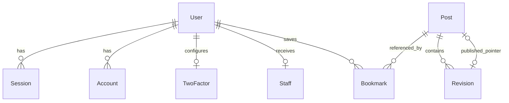
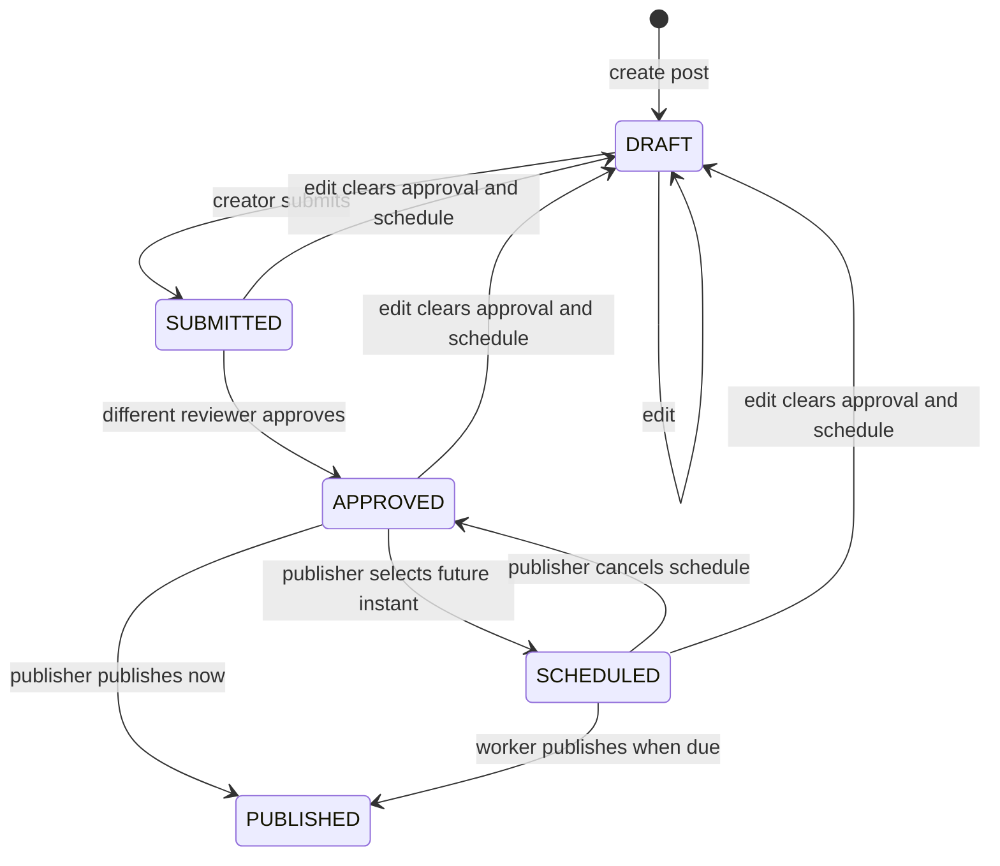
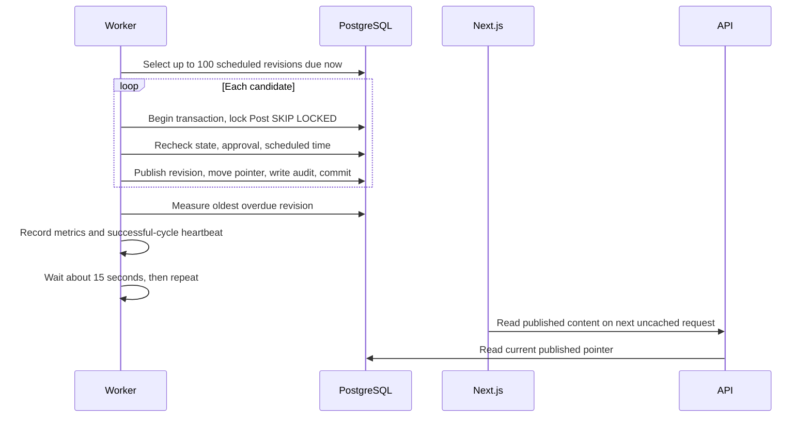

# Data model and publishing lifecycle

[Handbook](../README.md)

The [Prisma schema](../../libs/platform/database/schema.prisma) defines the model. [SQL migrations](../../libs/platform/database/migrations) also define constraints that cannot be recovered by reading the Prisma schema alone. Domains own their queries even though schema and migrations are centralized.

## Entity relationships

The optional published pointer references a revision of the same post through a composite foreign key. Every revision belongs to one post; a post has at most one current published pointer. Historical revisions can remain `PUBLISHED` without being the current pointer.

| Model             | Purpose and important constraints                                                          |
| ----------------- | ------------------------------------------------------------------------------------------ |
| `User`            | Unique email and optional unique username; email verification and MFA enablement           |
| `Session`         | Unique token, expiry, user relationship, server-controlled `mfaVerified`                   |
| `Account`         | Better Auth provider/password records; may hold sensitive authentication material          |
| `Verification`    | Authentication verification values and expiry                                              |
| `TwoFactor`       | One configuration per user; secret, recovery codes, verification/lockout fields            |
| `RateLimit`       | Persistent Better Auth counters keyed by request identifier                                |
| `Staff`           | One row per user, containing permission strings                                            |
| `StaffInvitation` | Target email, SHA-256 token hash, permissions, 48 hour expiry, acceptance timestamp        |
| `Post`            | Unique slug, owner/assignee identifiers, optional published revision pointer               |
| `Revision`        | Content snapshot, state, optimistic edit version, approval/schedule/publication timestamps |
| `Bookmark`        | Composite primary key `(userId, postId)` makes saving idempotent                           |
| `AuditEvent`      | Actor, action, resource, timestamp for publishing and staff changes                        |

Owner, assignee, approver, invitation actor, and audit identifiers are scalar strings, not all foreign keys to User. Audit actors also include `worker` and `bootstrap`. The diagram intentionally shows only modeled relations. Do not infer user deletion cascades for editorial history from these scalar identifiers.

## Revision states

Editing a `PUBLISHED` revision creates a **new** `DRAFT`; it does not transition the published row. The live pointer remains intact until the new revision is approved and published. Only one non-published working revision may exist per post; attempts to fork another are rejected. There is no unpublish, delete-post, rejection state, or arbitrary transition endpoint in this slice.

Approval belongs to the exact revision. The reviewer must have `post:review` and cannot be the owner or current assignee. The creator must own the post or be assigned to it. Scheduling and publication require `post:publish`. Slugs are set during creation and are not updated by the edit endpoint.

## Consistency and concurrency

1. A mutation finds the revision's post and locks that post row with `FOR UPDATE` inside a transaction.
2. It re-reads the revision, checks permission/ownership and transition rules, and for edits compares the supplied `version`.
3. It changes revision state, updates the published pointer where appropriate, and writes the audit event in the same transaction.
4. Commit makes those changes visible together. A stale edit returns `409`; the client should reload and reconcile before retrying.

The SQL migrations enforce one working revision per post, required approval fields for approved/scheduled/published rows, schedule/publication timestamps for their corresponding states, and that the published pointer belongs to the same post. Application authorization and allowed transitions remain necessary; database constraints do not encode every business rule.

Creation and assignment also audit their changes. Invitation issuance/acceptance and initial bootstrap are transactional; acceptance conditionally marks a still-unused invitation and resets existing session MFA verification. AuditEvent is an application table, not an immutable compliance archive, and does not capture every read or full before/after payload.

## Scheduled publication

Each candidate uses its own transaction. Multiple workers can discover the same candidates; row locks and a state recheck prevent duplicate successful publication. Locked posts are skipped and rediscovered later. The loop does not overlap work in one process.

If a cycle fails partway through, earlier commits remain published; uncommitted work rolls back and is rediscovered. The worker logs a failure and tries again in a later cycle. There is no separate dead-letter queue. The heartbeat updates only after the whole successful cycle, including lag measurement.

The polling delay is added after cycle execution, so backlog and database latency extend the interval. Nginx can add up to its public HTML freshness interval before a new request sees an update. Three-minute visibility is a healthy-operation objective, not a recovery guarantee or automatic refresh of an already open browser tab.

## Time, pagination, and retention

The editorial form accepts local wall time and converts it to an ISO UTC instant. The API requires an ISO timestamp with timezone information and a future time when scheduling. Keep deployment clocks synchronized; monitor publication lag.

Public/editorial/bookmark lists return 20 items per page. Editorial responses include up to the latest 20 revisions per post. Sitemap chunks contain up to 1,000 entries. Page inputs are bounded to 1 through 10,000. These are offset-based queries and are not an unbounded export API.

No general retention, audit export, user erasure, or automatic historical revision cleanup workflow is implemented. Before production, define retention and recovery requirements for content, account data, audit rows, database backups, and browser-test artifacts. See [operations](operations.md) for migration and restore procedures.
