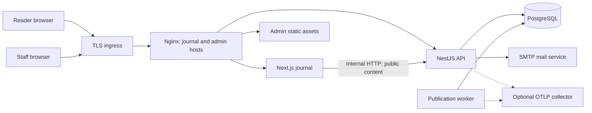
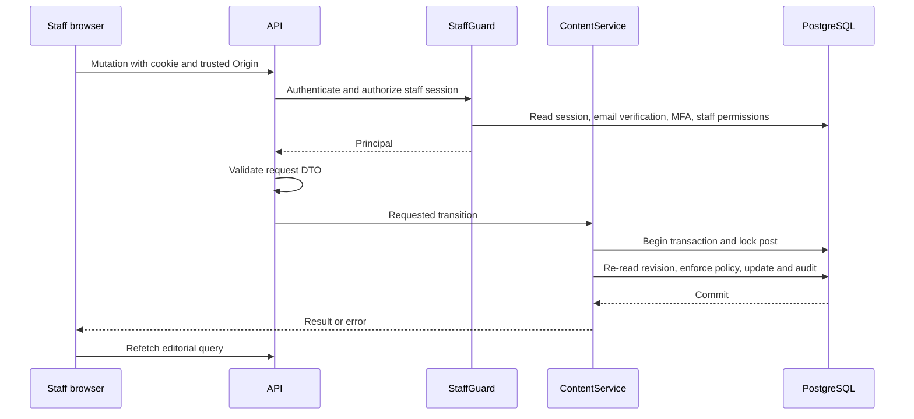
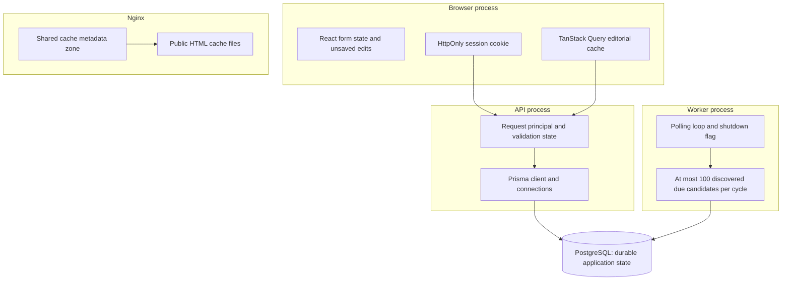

# Architecture and runtime state

[Handbook](../README.md)

Kara is an Nx monorepo with a modular NestJS API, a separate publication worker, a React editorial application, and a Next.js public journal. Domain libraries keep business rules together; independently running applications compose those libraries. PostgreSQL is the source of truth. There is no Redis queue, event bus, or direct frontend database access.

## System context

The TLS ingress, PostgreSQL, SMTP, and optional collector are external operational dependencies. Compose supplies API, worker, web, and Nginx. It does not provision those external services. Separate public hostnames isolate host-only session cookies; browser API calls use `/api` on the current frontend origin.

In local development, Vite proxies admin API requests and Next rewrites journal API requests. Nginx is not required for ordinary development; it is required when verifying the production HTML cache behavior.

## Request and mutation flow

Origin checks happen in API middleware before domain handlers. Nest guards enforce identity and staff access; DTO validation rejects unexpected fields. ContentService enforces per-action permissions and state transitions inside database transactions. UI controls reflect permissions but are not an authorization boundary.

Public content comes from the revision referenced by `Post.publishedRevisionId`. Saving a working draft cannot replace the published pointer. Next fetches public data with `cache: no-store`; only selected public HTML responses can be reused by Nginx for 60 seconds. See [data](data.md) and [cache policy](operations.md#cache-policy).

## Memory and persistence map

This is a logical state diagram, not a heap profile. There are no measured per-process memory limits or capacity guarantees in this repository.

| State                                   | Owner/lifetime                                           | Restart or refresh effect                                                             |
| --------------------------------------- | -------------------------------------------------------- | ------------------------------------------------------------------------------------- |
| Unsaved editorial fields                | React Hook Form/component state in one tab               | Reload loses unsaved edits; there is no persistent draft autosave in the browser      |
| Editorial/access query results          | Admin QueryClient in browser memory                      | Refetched after reload; editorial mutations invalidate editorial queries              |
| Account/bookmark UI and feedback        | React component state                                    | Refetched or cleared as the component's flow requires                                 |
| Session token                           | Browser HttpOnly cookie                                  | Can survive process restarts until expiry/revocation; JavaScript cannot read it       |
| Sessions, MFA verification, rate limits | PostgreSQL via Better Auth and application guards        | Survive API restarts; session cookie cache is disabled                                |
| Prisma connections                      | One Database provider per API/worker application context | Reconnect on startup, disconnect on context shutdown                                  |
| Due publication candidates              | Worker memory for a polling cycle                        | Rediscovered from PostgreSQL; not a durable queue in memory                           |
| Worker heartbeat                        | Local file, default `/tmp/kara-worker-heartbeat`         | Operational health signal only; not publication state                                 |
| Cached public HTML                      | Nginx cache storage, 60 second freshness                 | Disposable; container recreation may discard it; source content remains in PostgreSQL |
| Build/task cache                        | Nx tooling                                               | Developer/CI optimization, unrelated to runtime content/session caches                |

The Nginx configuration sets a 20 MB shared metadata zone and a 1 GB maximum cache file size. Those are cache settings, not API or frontend memory allocations. Additional API and worker processes each consume their own memory and database connections. Measure resident memory, database connection usage, and publication lag under intended load before sizing replicas.

## Architectural choices and limits

| Existing choice                             | Reason and consequence                                                                        |
| ------------------------------------------- | --------------------------------------------------------------------------------------------- |
| Domain modules in one API                   | Central transaction boundaries and simpler deployment; domain imports remain enforced         |
| Separate worker sharing ContentService      | Scheduled work runs without an HTTP request; API and worker follow the same publication rules |
| PostgreSQL row locks and constraints        | Concurrent actors cannot independently replace publication state without serialization        |
| HTTP contract between all frontends and API | Next server components do not bypass backend ownership or authorization rules                 |
| Plain text article bodies                   | React renders text; rich authored HTML is not accepted in this slice                          |
| Explicit public HTML cache allowlist        | Performance tradeoff has bounded freshness and avoids caching private responses               |

Uploads, comments, notifications, SMS, multi-tenancy, and moderation flows are not implemented. `interaction:moderate` exists as a permission identifier but has no corresponding moderation workflow. There is no automatic CDN invalidation, offline editorial persistence, or production deployment pipeline configured.

Sources: [API bootstrap](../../apps/api/src/bootstrap.ts), [worker](../../apps/worker/src/main.ts), [Nx configuration](../../nx.json), [Nginx](../../infra/nginx/nginx.conf), [boundaries](boundaries.md).
